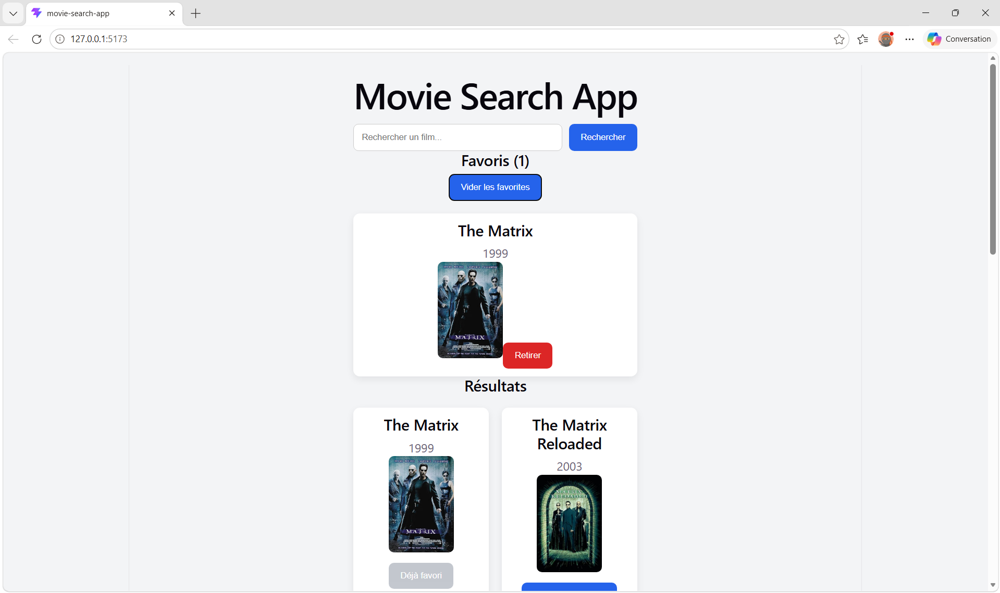

# Movie Search App

Application React permettant de rechercher des films via l'API OMDb et de gérer une liste de favoris

## Fonctionnalités

- Rechercher des films
- Afficher les résultats sous forme de cartes
- Afficher le titre, l'année et l'affiche du film
- Gérer les affiches manquantes
- Ajouter un film aux favoris
- Empêcher les doublons dans les favoris
- Retirer un film des favoris
- Vider tous les favoris avec confirmation
- Sauvagarder les favoris avec localStorage
- Gérer les états de chargement et d'erreur

## Technologies utilisées

- React
- Vite
- JavaScript
- CSS
- OMDb API
- Git / GitHub

## Installation

```bash
npm install
npm run dev
```

## Screenshot



## Auteur

Joseph Maro
